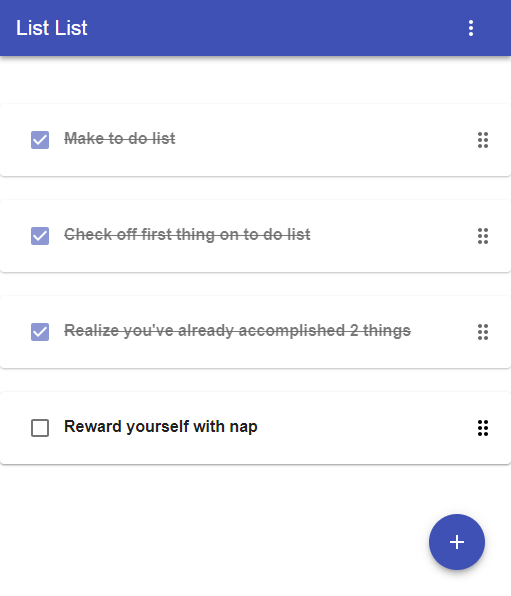

# listlist
Simple, sortable, mobile-friendly todo list web apps.



## Framework and libaries used:
- [React](https://github.com/facebook/react)
- [Create React App](https://github.com/facebookincubator/create-react-app)
- [Material-UI](https://github.com/mui-org/material-ui)
- [React Sortable (HOC)](https://github.com/clauderic/react-sortable-hoc)
- [Copy-to-clipboard React component](https://github.com/nkbt/react-copy-to-clipboard)

### Installation:

```bash
> git clone https://github.com/sse87/listlist.git
> cd listlist
> npm install
> npm start
```

## [try it out](https://sse87.github.io/listlist/)
